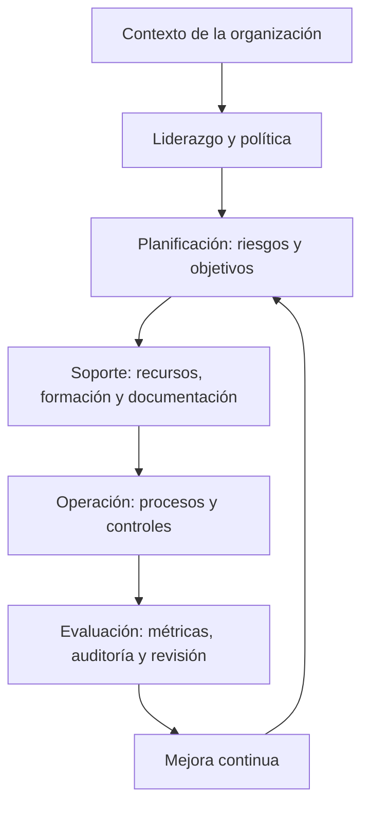
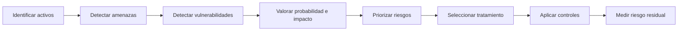
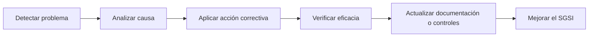

# ISO 27001 y SGSI — Guía práctica para empresa

> [!info] Objetivo del documento
> Este documento resume de forma práctica qué es **ISO/IEC 27001**, qué es un **SGSI** y cómo una organización puede implantarlo, revisarlo y mejorarlo. Está pensado como una guía clara para entender la norma y presentarla en un entorno empresarial.

---

## 1. Idea base

**ISO/IEC 27001** es una norma internacional para gestionar la **seguridad de la información** mediante un **Sistema de Gestión de Seguridad de la Información**.

Un **SGSI** no es solo instalar antivirus, firewalls o controles técnicos. Es un sistema completo para organizar cómo una empresa protege su información mediante:

- políticas;
- gestión de riesgos;
- controles de seguridad;
- responsabilidades;
- documentación;
- auditorías;
- medición de resultados;
- mejora continua.

> [!important] Resumen rápido
> **ISO 27001 no es solo tecnología. Es gestión de la seguridad de la información.**
>
> Su objetivo es proteger la **confidencialidad**, **integridad** y **disponibilidad** de la información.

---

## 2. Conceptos esenciales

| Concepto | Significado práctico |
|---|---|
| **Información** | Datos con valor para la organización: clientes, contratos, sistemas, credenciales, documentación, código, bases de datos, procesos, etc. |
| **Seguridad de la información** | Protección de la información frente a accesos indebidos, alteraciones, pérdidas o indisponibilidad. |
| **SGSI** | Sistema de Gestión de Seguridad de la Información. Organiza políticas, riesgos, controles, responsables, auditorías y mejora continua. |
| **Activo** | Cualquier elemento con valor para la organización: datos, servidores, aplicaciones, personas, instalaciones, proveedores, documentación. |
| **Amenaza** | Causa potencial de daño: malware, error humano, robo, incendio, fallo eléctrico, fuga de datos. |
| **Vulnerabilidad** | Debilidad que puede ser explotada: contraseña débil, servidor sin parches, falta de backups, exceso de permisos. |
| **Riesgo** | Posibilidad de que una amenaza aproveche una vulnerabilidad y genere impacto. |
| **Control** | Medida para reducir, evitar, transferir o gestionar un riesgo. |
| **Riesgo residual** | Riesgo que queda después de aplicar controles. |
| **SoA** | Declaración de Aplicabilidad. Documento que indica qué controles aplican, cuáles no y por qué. |
| **Auditoría interna** | Revisión realizada por la propia organización para comprobar si el SGSI funciona. |
| **Certificación** | Auditoría externa que confirma oficialmente la conformidad con ISO 27001. |

---

## 3. Confidencialidad, integridad y disponibilidad

La seguridad de la información se apoya en tres pilares:

| Pilar | Pregunta clave | Ejemplo |
|---|---|---|
| **Confidencialidad** | ¿Solo accede quien está autorizado? | Control de accesos, cifrado, NDA, mínimos privilegios. |
| **Integridad** | ¿La información es correcta y no ha sido alterada indebidamente? | Hashes, control de cambios, registros, validaciones. |
| **Disponibilidad** | ¿La información está accesible cuando se necesita? | Backups, redundancia, continuidad, monitorización. |

> [!tip] Forma fácil de recordarlo
> **Confidencialidad = quién puede ver.**  
> **Integridad = que no se altere sin control.**  
> **Disponibilidad = que esté accesible cuando haga falta.**

---

## 4. ISO 27001 dentro de la familia ISO 27000

| Norma | Para qué sirve |
|---|---|
| **ISO 27000** | Conceptos generales y vocabulario. |
| **ISO 27001** | Requisitos del SGSI. Es la norma principal y certificable. |
| **ISO 27002** | Guía de buenas prácticas para aplicar controles de seguridad. |
| **ISO 27003** | Guía de implantación de un SGSI. |
| **ISO 27004** | Métricas y medición del SGSI. |
| **ISO 27005** | Gestión de riesgos de seguridad de la información. |
| **ISO 27006** | Requisitos para entidades certificadoras. |
| **ISO 27007** | Guía para auditar un SGSI. |
| **ISO 27008** | Guía para auditar controles concretos. |
| **ISO 27035** | Gestión de incidentes de seguridad de la información. |

> [!summary] Idea clave
> **ISO 27001 dice qué debe cumplirse.**  
> **ISO 27002 ayuda a decidir cómo aplicar controles.**  
> El resto de normas apoyan la implantación, medición, auditoría o adaptación sectorial.

---

## 5. Diferencia entre ISO 27001 e ISO 27002

| ISO 27001 | ISO 27002 |
|---|---|
| Es certificable. | No es certificable por sí sola. |
| Contiene requisitos obligatorios para el SGSI. | Contiene recomendaciones y buenas prácticas. |
| Se usa para auditar y certificar el sistema. | Se usa como apoyo para elegir e implantar controles. |
| Responde a: **qué debe cumplir la organización**. | Responde a: **cómo puedo aplicar controles de seguridad**. |

> [!important] Frase clave
> **ISO 27001 exige. ISO 27002 orienta.**

---

## 6. Estructura práctica de ISO 27001

ISO 27001 se entiende mejor como un ciclo de gestión. Antes de aplicar controles técnicos, la empresa debe entender su contexto, definir el alcance, planificar riesgos, aplicar controles, medir resultados y mejorar.

| Bloque | Qué significa en la práctica |
|---|---|
| **Contexto** | Entender la empresa, su actividad, entorno, requisitos y partes interesadas. |
| **Liderazgo** | La alta dirección debe apoyar, asignar recursos y aprobar la política de seguridad. |
| **Planificación** | Identificar riesgos, oportunidades y objetivos de seguridad. |
| **Soporte** | Aportar recursos, competencias, formación, comunicación y documentación. |
| **Operación** | Ejecutar procesos, evaluar riesgos y aplicar controles. |
| **Evaluación del desempeño** | Medir, auditar y revisar si el SGSI funciona. |
| **Mejora** | Corregir no conformidades y mejorar continuamente. |



---

## 7. Contexto de la organización

La organización debe analizar los factores internos y externos que pueden afectar al SGSI.

| Tipo de contexto | Ejemplos |
|---|---|
| **Interno** | Procesos, empleados, sistemas, cultura, estructura, recursos, objetivos de negocio. |
| **Externo** | Leyes, clientes, mercado, competencia, proveedores, tecnología, economía, sector. |

Este análisis evita implantar controles de forma genérica. No tiene los mismos riesgos una clínica, una tienda online, una entidad financiera o una empresa de desarrollo software.

> [!example] Ejemplo
> Una empresa de e-commerce debe prestar especial atención a datos de clientes, pagos, disponibilidad de la plataforma, proveedores tecnológicos y cumplimiento legal.

---

## 8. Partes interesadas

Las partes interesadas son personas, grupos u organizaciones que influyen en el SGSI o se ven afectadas por él.

| Parte interesada | Qué puede exigir o necesitar |
|---|---|
| Alta dirección | Control, continuidad, cumplimiento, reducción de riesgos. |
| Empleados | Procedimientos claros, formación y accesos adecuados. |
| Clientes | Protección de datos, disponibilidad, confianza y transparencia. |
| Proveedores | Requisitos contractuales, coordinación y seguridad en la cadena de suministro. |
| Socios / accionistas | Reputación, continuidad y reducción de pérdidas. |
| Reguladores | Cumplimiento legal, evidencias y trazabilidad. |

> [!tip] Pregunta útil
> ¿Quién puede exigir seguridad, verse afectado por un incidente o influir en cómo se protege la información?

---

## 9. Alcance del SGSI

El alcance define qué partes de la organización quedan dentro del SGSI.

Debe indicar, como mínimo:

- procesos incluidos;
- áreas o departamentos;
- sedes físicas;
- sistemas y aplicaciones;
- activos de información;
- proveedores relevantes;
- exclusiones justificadas.

| Buen alcance | Mal alcance |
|---|---|
| “Plataforma e-commerce, infraestructura cloud, base de datos de clientes, procesos de soporte y proveedores críticos asociados.” | “La seguridad de la empresa.” |
| Es concreto, verificable y auditable. | Es demasiado genérico y no permite saber qué se protege. |

> [!warning] Punto crítico
> Si el alcance está mal definido, los riesgos, controles y auditorías también estarán mal orientados.

---

## 10. Liderazgo y compromiso

ISO 27001 exige implicación real de la alta dirección.

La dirección debe:

- aprobar la política de seguridad;
- definir responsabilidades;
- asignar recursos;
- apoyar la gestión de riesgos;
- revisar resultados;
- exigir cumplimiento;
- promover mejora continua.

> [!danger] Error habitual
> Pensar que ISO 27001 es solo responsabilidad del departamento de informática.
>
> En realidad, ISO 27001 es una norma de gestión: afecta a dirección, legal, RR. HH., operaciones, IT, proveedores y usuarios.

---

## 11. Política de seguridad de la información

La política de seguridad es el documento base que expresa el compromiso de la organización con la protección de la información.

Debe ser:

- aprobada por la dirección;
- alineada con los objetivos de negocio;
- comunicada a las partes relevantes;
- revisada periódicamente;
- coherente con los riesgos y controles del SGSI.

> [!example] Ejemplo de idea de política
> La organización se compromete a proteger la confidencialidad, integridad y disponibilidad de la información, cumplir los requisitos legales y contractuales aplicables, formar al personal y mejorar continuamente el SGSI.

---

## 12. Roles y responsabilidades

| Rol habitual | Responsabilidad principal |
|---|---|
| **Alta dirección** | Aprobar política, objetivos, recursos y revisión del SGSI. |
| **Responsable del SGSI** | Coordinar el sistema, seguimiento, evidencias, auditorías y mejora. |
| **Responsables de área** | Aplicar controles en sus procesos y reportar incidencias. |
| **IT / Seguridad** | Implementar controles técnicos y mantener sistemas seguros. |
| **RR. HH.** | Gestionar formación, altas, bajas y responsabilidades del personal. |
| **Legal / Compliance** | Identificar requisitos legales, regulatorios y contractuales. |
| **Empleados** | Cumplir políticas y comunicar incidentes o debilidades. |
| **Proveedores** | Cumplir requisitos de seguridad acordados contractualmente. |

---

## 13. Gestión de riesgos

La gestión de riesgos es el núcleo práctico del SGSI.



### Fórmula mental

```text
Riesgo = Amenaza + Vulnerabilidad + Impacto sobre un activo
```

| Fase | Qué se hace |
|---|---|
| **Identificación** | Se detectan activos, amenazas, vulnerabilidades y escenarios de riesgo. |
| **Análisis** | Se estima probabilidad e impacto. |
| **Evaluación** | Se decide si el riesgo es aceptable o requiere tratamiento. |
| **Tratamiento** | Se eligen medidas: reducir, evitar, transferir o aceptar. |
| **Seguimiento** | Se revisa si el riesgo residual sigue siendo aceptable. |

---

## 14. Opciones de tratamiento del riesgo

| Opción | Significado | Ejemplo |
|---|---|---|
| **Reducir** | Aplicar controles para bajar probabilidad o impacto. | MFA, backups, cifrado, parches. |
| **Evitar** | Dejar de realizar la actividad que genera el riesgo. | Eliminar un servicio inseguro. |
| **Transferir** | Pasar parte del riesgo a un tercero. | Seguro, proveedor especializado, contrato. |
| **Aceptar** | Asumir el riesgo porque está dentro del nivel tolerable. | Riesgo bajo documentado y aprobado. |

> [!important] Clave
> Aceptar un riesgo no significa ignorarlo. Debe estar documentado, justificado y aprobado.

---

## 15. Controles de seguridad

Los controles son medidas para tratar riesgos. Pueden ser técnicos, organizativos, físicos o relacionados con personas.

| Tipo de control | Ejemplos |
|---|---|
| **Organizativo** | Políticas, procedimientos, gestión de proveedores, clasificación de información. |
| **Personas** | Formación, concienciación, acuerdos de confidencialidad, gestión de altas y bajas. |
| **Físico** | Control de acceso a oficinas, CCTV, protección contra incendios, seguridad de salas técnicas. |
| **Tecnológico** | MFA, cifrado, backups, EDR, firewalls, hardening, registros, monitorización. |

### Anexo A de ISO 27001:2022

El Anexo A funciona como catálogo de referencia de controles. En ISO 27001:2022 los controles se agrupan en cuatro grandes bloques:

| Bloque | Enfoque |
|---|---|
| **Organizational controls** | Gobierno, políticas, riesgos, proveedores, incidentes, continuidad, cumplimiento. |
| **People controls** | Concienciación, responsabilidades, confidencialidad, trabajo remoto, finalización laboral. |
| **Physical controls** | Instalaciones, acceso físico, equipos, cableado, mantenimiento, eliminación segura. |
| **Technological controls** | Accesos, autenticación, malware, backups, logs, redes, desarrollo seguro, cifrado. |

> [!note] Importante
> No todos los controles aplican a todas las empresas. La organización debe justificar qué controles aplica, cuáles excluye y por qué.

---

## 16. Declaración de Aplicabilidad \(SoA\)

La **Declaración de Aplicabilidad** o **Statement of Applicability** es uno de los documentos más importantes del SGSI.

Debe recoger:

- controles aplicables;
- controles no aplicables;
- justificación de inclusión o exclusión;
- estado de implantación;
- relación con riesgos tratados.

| Control | ¿Aplica? | Justificación | Estado |
|---|---:|---|---|
| Control de accesos | Sí | Existen usuarios con acceso a datos sensibles. | Implantado / en revisión |
| Cifrado | Sí | Se tratan datos confidenciales y credenciales. | Parcial |
| Seguridad física avanzada | Depende | Puede no aplicar si toda la infraestructura está en cloud, pero sí aplican controles sobre oficinas y dispositivos. | Pendiente de análisis |

> [!warning] Punto de auditoría
> Una exclusión mal justificada puede ser una no conformidad.

---

## 17. Planificación y objetivos de seguridad

La organización debe establecer objetivos de seguridad medibles y coherentes con la política.

| Objetivo | Indicador posible |
|---|---|
| Reducir incidentes por phishing. | % de empleados que superan simulaciones de phishing. |
| Mejorar gestión de vulnerabilidades. | % de vulnerabilidades críticas corregidas en plazo. |
| Aumentar disponibilidad de sistemas críticos. | Uptime mensual / tiempo medio de recuperación. |
| Mejorar control de accesos. | % de accesos revisados trimestralmente. |
| Mejorar concienciación. | % de empleados formados en seguridad. |

> [!tip] Un objetivo ISO debe responder
> Qué se quiere conseguir, quién es responsable, qué recursos hacen falta, cuándo se revisa y cómo se mide.

---

## 18. Soporte: recursos, competencia y documentación

El SGSI necesita soporte real para funcionar.

| Elemento | Qué implica |
|---|---|
| **Recursos** | Presupuesto, herramientas, tiempo, personal y apoyo directivo. |
| **Competencia** | Personas capacitadas para realizar tareas de seguridad. |
| **Concienciación** | Que el personal entienda sus responsabilidades. |
| **Comunicación** | Saber qué comunicar, a quién, cuándo y por qué canal. |
| **Información documentada** | Políticas, procedimientos, registros, evidencias y resultados controlados. |

> [!important] Corrección útil
> En ISO 27001, el punto 7 se refiere al **soporte** del sistema: recursos, competencia, concienciación, comunicación e información documentada. No debe confundirse con “calidad” o solo “software”.

---

## 19. Operación del SGSI

La operación consiste en ejecutar lo planificado:

- aplicar procesos de gestión de riesgos;
- ejecutar planes de tratamiento;
- implantar controles;
- gestionar cambios;
- mantener evidencias;
- controlar proveedores;
- gestionar incidentes;
- revisar que los procesos se cumplen.

| Proceso operativo | Ejemplo |
|---|---|
| Gestión de accesos | Altas, bajas, permisos, revisiones periódicas. |
| Gestión de incidentes | Registro, análisis, respuesta y lecciones aprendidas. |
| Gestión de vulnerabilidades | Escaneo, priorización, parcheo y verificación. |
| Gestión de copias de seguridad | Programación, pruebas de restauración y protección. |
| Gestión de proveedores | Evaluación, contratos, SLA y requisitos de seguridad. |

---

## 20. Evaluación del desempeño

Un SGSI debe medirse. No basta con tener documentos.

| Método | Qué comprueba |
|---|---|
| **Seguimiento y medición** | Si los controles y procesos funcionan. |
| **Indicadores / KPIs** | Resultados medibles del SGSI. |
| **Auditoría interna** | Si el SGSI cumple la norma y los requisitos internos. |
| **Revisión por la dirección** | Si el sistema sigue siendo adecuado, eficaz y alineado con el negocio. |

### Ejemplos de KPIs

| Área | KPI |
|---|---|
| Incidentes | Número de incidentes por mes, tiempo medio de respuesta, tiempo medio de resolución. |
| Vulnerabilidades | % de vulnerabilidades críticas corregidas en plazo. |
| Accesos | % de cuentas revisadas, número de cuentas huérfanas detectadas. |
| Formación | % de empleados formados, resultados de simulaciones de phishing. |
| Continuidad | Éxito de pruebas de restauración, RTO/RPO cumplidos. |
| Proveedores | % de proveedores críticos evaluados. |

---

## 21. Auditoría interna

La auditoría interna revisa si el SGSI:

- cumple ISO 27001;
- cumple requisitos legales, contractuales e internos;
- está correctamente implantado;
- conserva evidencias;
- funciona en la práctica;
- detecta desviaciones o no conformidades.

| Elemento auditado | Pregunta práctica |
|---|---|
| Alcance | ¿Está claro qué cubre el SGSI? |
| Riesgos | ¿Existe metodología y registro de riesgos? |
| Controles | ¿Están implantados y justificados en la SoA? |
| Evidencias | ¿Hay registros que demuestren que se aplica el sistema? |
| Dirección | ¿La alta dirección revisa y apoya el SGSI? |
| Mejora | ¿Se corrigen no conformidades y se revisa su eficacia? |

---

## 22. Mejora continua

La mejora continua permite que el SGSI no se quede obsoleto.

| Concepto | Significado |
|---|---|
| **No conformidad** | Incumplimiento de un requisito de la norma, política, proceso o control. |
| **Acción correctiva** | Medida para eliminar la causa de una no conformidad. |
| **Mejora continua** | Revisión y evolución del SGSI para hacerlo más eficaz. |



---

## 23. PDCA aplicado a ISO 27001

ISO 27001 puede entenderse con el ciclo **PDCA**:

| Fase | Qué significa en un SGSI |
|---|---|
| **Plan — Planificar** | Contexto, alcance, riesgos, objetivos, controles y documentación. |
| **Do — Hacer** | Implantar procesos, controles y planes de tratamiento. |
| **Check — Verificar** | Medir, auditar, revisar resultados y comprobar eficacia. |
| **Act — Actuar** | Corregir, mejorar y actualizar el SGSI. |

> [!summary] Idea clave
> ISO 27001 no se implanta una vez y se olvida. Se mantiene mediante revisión, auditoría y mejora continua.

---

## 24. Certificación vs conformidad

| Concepto | Significado |
|---|---|
| **Conformidad** | La organización aplica los requisitos de ISO 27001, aunque no tenga certificado externo. |
| **Certificación** | Un organismo certificador audita el SGSI y confirma oficialmente que cumple ISO 27001. |

La certificación aporta confianza externa, prestigio, ventaja competitiva y puede ser necesaria en licitaciones o contratos. Aun así, lo más importante es que el SGSI funcione realmente y reduzca riesgos.

> [!note] Estado actual
> La versión de referencia es **ISO/IEC 27001:2022**. Las organizaciones certificadas en la versión anterior tuvieron un periodo de transición que finalizó en 2025, por lo que en nuevos proyectos debe trabajarse sobre la versión 2022.

---

## 25. Beneficios empresariales

| Ámbito | Beneficio principal |
|---|---|
| **Organizacional** | Ordena la seguridad, define responsabilidades y mejora la gobernanza. |
| **Legal / cumplimiento** | Ayuda a identificar y cumplir requisitos legales, regulatorios y contractuales. |
| **Funcional** | Mejora la gestión de riesgos, incidentes, activos y continuidad. |
| **Comercial** | Aporta confianza a clientes, socios, proveedores y mercado. |
| **Financiero** | Reduce costes potenciales asociados a incidentes, interrupciones o sanciones. |
| **Humano** | Mejora la concienciación del personal y reduce errores humanos. |

> [!tip] En una empresa
> Los beneficios son consecuencia de aplicar bien el SGSI, no el objetivo único. El objetivo real es gestionar la seguridad de forma controlada y sostenible.

---

## 26. Cómo implantar ISO 27001 en una empresa

### Roadmap práctico

| Fase | Resultado esperado |
|---|---|
| **1. Compromiso inicial** | Dirección acepta el proyecto, recursos y responsable del SGSI. |
| **2. Contexto y alcance** | Se define qué partes de la empresa cubre el SGSI. |
| **3. Partes interesadas y requisitos** | Se identifican clientes, proveedores, empleados, reguladores y obligaciones. |
| **4. Inventario de activos** | Se listan activos de información y responsables. |
| **5. Evaluación de riesgos** | Se identifican amenazas, vulnerabilidades, impacto y probabilidad. |
| **6. Tratamiento de riesgos** | Se seleccionan controles y acciones. |
| **7. Declaración de Aplicabilidad** | Se documentan controles aplicables, exclusiones y justificación. |
| **8. Implantación de controles** | Se aplican medidas organizativas, técnicas, físicas y de personas. |
| **9. Formación y comunicación** | El personal conoce políticas y responsabilidades. |
| **10. Medición y auditoría interna** | Se comprueba si el sistema funciona y cumple requisitos. |
| **11. Revisión por dirección** | Dirección evalúa resultados, riesgos, recursos y mejoras. |
| **12. Mejora continua** | Se corrigen no conformidades y se actualiza el SGSI. |
| **13. Certificación externa** | Opcional, si la empresa quiere demostrar conformidad oficialmente. |

---

## 27. Documentación mínima recomendable

| Documento / registro | Para qué sirve |
|---|---|
| Alcance del SGSI | Define límites y aplicabilidad. |
| Política de seguridad | Establece compromiso y principios. |
| Metodología de riesgos | Explica cómo se valoran riesgos. |
| Inventario de activos | Identifica qué debe protegerse. |
| Registro de riesgos | Documenta riesgos, nivel y tratamiento. |
| Plan de tratamiento de riesgos | Indica acciones, responsables y plazos. |
| Declaración de Aplicabilidad | Justifica controles aplicables y excluidos. |
| Procedimientos operativos | Accesos, incidentes, backups, proveedores, cambios, etc. |
| Registros de formación | Evidencia de concienciación y competencia. |
| Auditoría interna | Evidencia de revisión del SGSI. |
| Revisión por dirección | Decisiones, resultados y mejoras aprobadas. |
| No conformidades y acciones correctivas | Seguimiento de problemas y soluciones. |

---

## 28. Checklist rápido para revisar una empresa

| Pregunta | Sí / No / Pendiente |
|---|---|
| ¿Existe un alcance del SGSI documentado y claro? |  |
| ¿La dirección participa y aporta recursos? |  |
| ¿Existe una política de seguridad aprobada? |  |
| ¿Se han identificado partes interesadas y requisitos? |  |
| ¿Hay inventario de activos de información? |  |
| ¿Existe una metodología de análisis de riesgos? |  |
| ¿Los riesgos están documentados y priorizados? |  |
| ¿Existe plan de tratamiento de riesgos? |  |
| ¿Está creada y mantenida la Declaración de Aplicabilidad? |  |
| ¿Los controles seleccionados tienen evidencias? |  |
| ¿El personal recibe formación y concienciación? |  |
| ¿Se gestionan incidentes de seguridad? |  |
| ¿Se revisan accesos periódicamente? |  |
| ¿Se prueban backups y continuidad? |  |
| ¿Se evalúan proveedores críticos? |  |
| ¿Existen KPIs de seguridad? |  |
| ¿Se realizan auditorías internas? |  |
| ¿La dirección revisa el SGSI? |  |
| ¿Se gestionan no conformidades y acciones correctivas? |  |
| ¿El SGSI se mejora de forma continua? |  |

---

## 29. Señales de que ISO 27001 no se está aplicando bien

| Señal | Qué puede indicar |
|---|---|
| Mucha documentación pero pocas evidencias | SGSI de papel, no operativo. |
| La dirección no participa | Falta de liderazgo real. |
| El alcance es ambiguo | Riesgos y controles mal definidos. |
| No hay inventario de activos | No se sabe exactamente qué proteger. |
| Los riesgos no se revisan | El SGSI queda desactualizado. |
| La SoA no justifica exclusiones | Posible no conformidad. |
| No se miden controles | No se puede demostrar eficacia. |
| No hay auditoría interna | Falta de verificación independiente. |
| Los empleados desconocen políticas | Fallo de comunicación y concienciación. |
| No se corrigen no conformidades | No existe mejora continua real. |

---

## 30. Resumen ejecutivo para empresa

ISO 27001 permite a una organización gestionar la seguridad de la información de forma estructurada, medible y mejorable. Su objetivo no es solo obtener un certificado, sino crear un sistema que ayude a identificar riesgos, aplicar controles, asignar responsabilidades, cumplir requisitos legales y generar confianza en clientes y socios.

Para implantarla correctamente, la organización debe empezar por definir el contexto, las partes interesadas y el alcance del SGSI. Después debe gestionar riesgos, seleccionar controles, documentar decisiones, formar al personal, medir resultados, realizar auditorías internas y mejorar de forma continua.

La certificación ISO 27001 puede aportar valor comercial y reputacional, pero solo tiene sentido si el SGSI funciona en la práctica y está integrado en los procesos reales de la empresa.

---

## 31. Glosario rápido

| Término | Definición breve |
|---|---|
| **SGSI** | Sistema que organiza la gestión de la seguridad de la información. |
| **CIA** | Confidencialidad, Integridad y Disponibilidad. |
| **Activo** | Elemento con valor que debe protegerse. |
| **Amenaza** | Posible causa de daño. |
| **Vulnerabilidad** | Debilidad explotable. |
| **Riesgo** | Posibilidad de impacto negativo sobre un activo. |
| **Control** | Medida para tratar un riesgo. |
| **SoA** | Documento que justifica controles aplicables y excluidos. |
| **No conformidad** | Incumplimiento de un requisito. |
| **Acción correctiva** | Medida para eliminar la causa de una no conformidad. |
| **Auditoría interna** | Revisión del SGSI desde dentro de la organización. |
| **Certificación** | Validación externa del cumplimiento de ISO 27001. |

---

## 32. Referencias y recursos

- ISO — ISO/IEC 27001 Information security management systems: https://www.iso.org/isoiec-27001-information-security.html
- ISO — ISO/IEC 27001:2022 standard page: https://www.iso.org/standard/27001
- ISO — ISO/IEC 27002 information security controls: https://www.iso.org/standard/75652.html
- UNE — Asociación Española de Normalización: https://www.une.org/
- AENOR — Certificación ISO/IEC 27001: https://www.aenor.com/certificacion/tecnologias-de-la-informacion/seguridad-informacion-iso-27001
- INCIBE — Instituto Nacional de Ciberseguridad: https://www.incibe.es/
- AEPD — Agencia Española de Protección de Datos: https://www.aepd.es/
- ENISA — Cybersecurity guidance and publications: https://www.enisa.europa.eu/

---

## 33. Frase final

> [!success] Idea final
> ISO 27001 consiste en demostrar que la empresa sabe **qué información protege**, **qué riesgos tiene**, **qué controles aplica**, **quién es responsable**, **cómo mide la eficacia** y **cómo mejora continuamente**.
